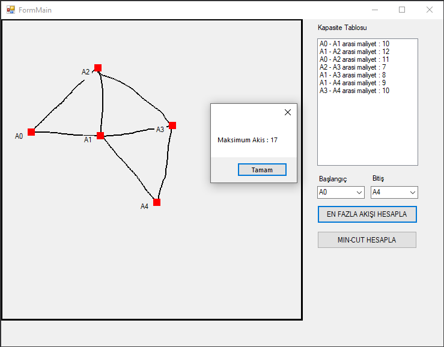
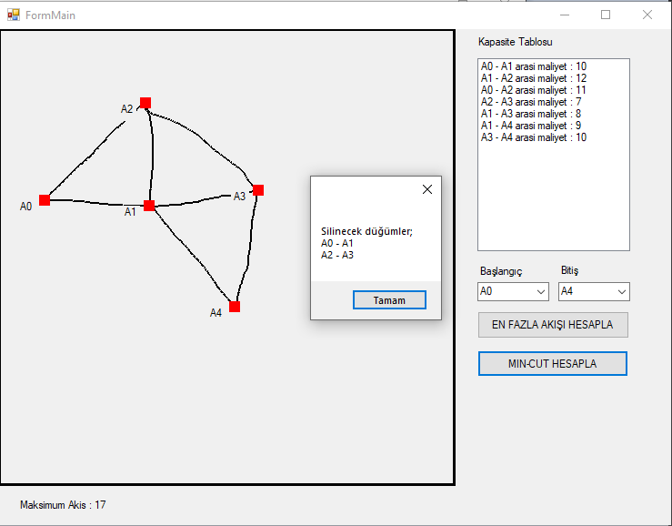

## MaksimumAkisAlgoritmasi
Projenin amacı oluşturulan boru hattından başlangıç ve bitiş arasında maksimum akış değerini, yolunu ve min-cut düğümlerinin bulunmasıdır.
Boru hattını kullanıcı kendisi çizerek oluşturuyor.

### Geliştiriciler
- **Mehmet Emin Arslan**

Görüntüye baktığımız zaman a0 başlangıç düğümü ve a4 bitiş düğümü için maksimum akışı ve yolu görebiliriz.
 

Görüntüye baktığımız zaman akışın kesilmesi için kapatılması gereken minimum yolları görüyoruz.
